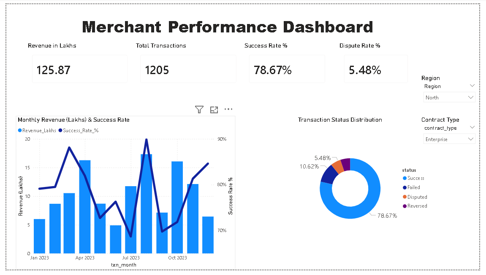
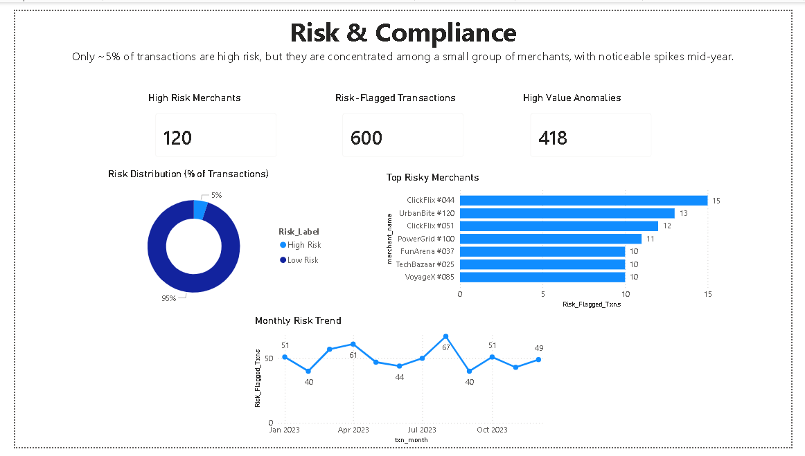
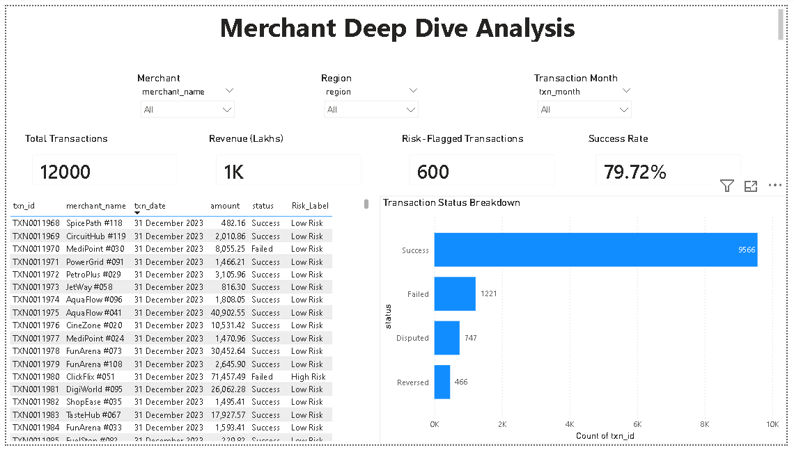

# Merchant Performance Dashboard (Power BI)

## Overview

Interactive Power BI dashboard analyzing merchant transactions, revenue, success rate, and risk patterns across a payments network.

## Objectives

- Track key KPIs (Revenue, Total Transactions, Success Rate, Dispute Rate)
- Identify high-risk transactions and merchants
- Monitor monthly trends and regional performance
- Enable drill-down analysis at merchant level

---

## Dashboard Pages

### 1. Overview

- Revenue (Lakhs), Total Transactions, Success Rate, Dispute Rate
- Monthly Revenue vs Success Rate trend
- Transaction Status Distribution (Donut)

### 2. Risk & Compliance

- High-Risk Merchants
- Risk-Flagged Transactions
- High Value Anomalies
- Risk Distribution (% of transactions)
- Top Risky Merchants (Top 5)
- Monthly Risk Trend

### 3. Merchant Deep Dive

- Filters: Merchant, Region, Transaction Month
- KPIs filtered by selection
- Transaction-level table (txn_id, date, amount, status, risk)
- Status breakdown chart

---

## Key Insights

- ~80% of transactions are successful across the network
- ~5% transactions are flagged as high risk
- Risk is concentrated among a small group of merchants
- Mid-year spike observed in risk-flagged transactions
- Dispute rate remains relatively low but varies by segment

---

## Data & Model

- Fact table: transactions
- Dimensions: merchants, customers, disputes
- Relationships built using merchant_id and customer_id

---

## Key Measures (DAX)

- Total_Txns
- Revenue_Lakhs
- Success*Rate*%
- Dispute*Rate*%
- Risk_Flagged_Txns

---

## Tools Used

- Power BI Desktop
- DAX (Data Analysis Expressions)
- Data Modeling

---

## Files Included

- pbix/Merchant_Performance_Dashboard.pbix → Main dashboard
- docs/dashboard.pdf → Static export of dashboard
- images/ → Dashboard screenshots

---

## How to Use

1. Open the PBIX file in Power BI Desktop
2. Use slicers (Merchant, Region, Month) to filter data
3. Explore trends and drill down into merchant-level performance

---

## Screenshots

### Overview

### Risk & Compliance

### Merchant Deep Dive

